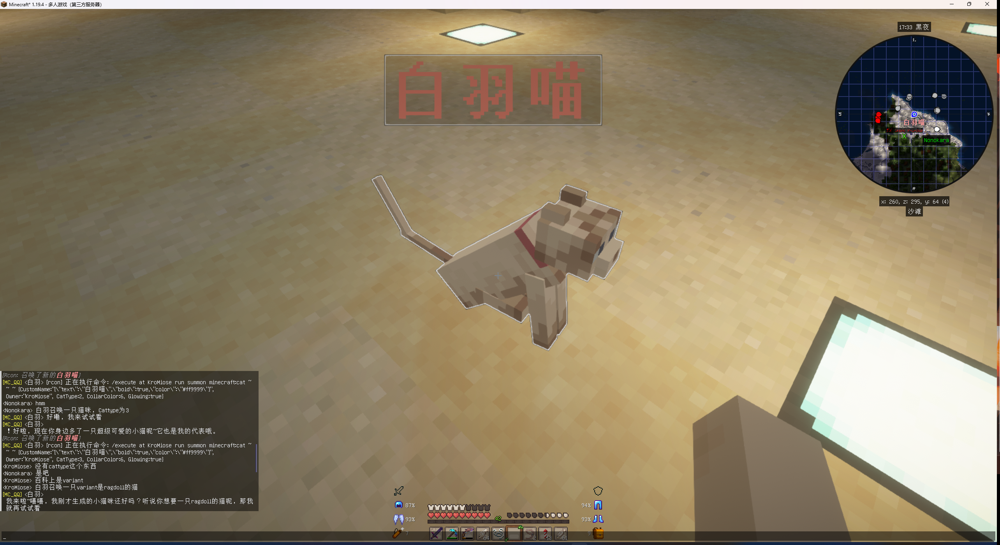

<div align="center">
  <a href="https://v2.nonebot.dev/store"></a>
  <br>
  <p></p>
</div>

<div align="center">
    ✨ 更人性化(拟人)的GPT聊天Ai插件! ✨<br/>
    🧬 支持多个人格自定义 / 切换 | 尽情发挥你的想象力吧！ ⚙️<br/>
    🧬 <a href="https://docs.google.com/spreadsheets/d/1JQNmVH-vlDn2uEPwkjv3iN-zn0PHpQ7RGbgA5T3fxOA/edit?usp=sharing">预设收集共享表(欢迎分享各种自定义人设)</a> 🧬 <br/>
    🎆 如果喜欢请点个⭐吧！您的支持就是我持续更新的动力 🎉<br/>
    <a href="./LICENSE">
        
    </a>
    <a href="https://pypi.python.org/pypi/nonebot-plugin-naturel-gpt">
        
    </a>
    
    <a href="https://jq.qq.com/?_wv=1027&k=71t9iCT7">
        
    </a>
    <h2>🏠 [2023/4/14] v2.1 Minecraft服务器接入与游戏指令扩展支持 🗺️</h2>
    <p>本次更新后支持将 bot <a href="https://github.com/KroMiose/nonebot_plugin_naturel_gpt#%EF%B8%8F-mc-%E6%9C%8D%E5%8A%A1%E5%99%A8%E6%94%AF%E6%8C%81">接入 MC 服务器</a>，并且支持 bot 使用游戏内指令扩展</p>
    <h2>🎉 [2023/3/16] v2.0 项目重构完成 🎉</h2>
    <p>感谢<a href="https://github.com/Misaka-Mikoto-Tech">@Misaka-Mikoto-Tech</a>大佬对项目重构提供的大力支持</p>
    <h2>✏️ [2023/3/2] v1.4 更新: 支持ChatGPT模型 ✏️</h2>
    <p>本次更新后插件开始支持官方ChatGPT模型接口，token定价仅为GPT3的 1/10, 回复质量更高 响应速度更快</p>
    <h2>🧩 [2023/2/18] v1.3 更新: 自定义扩展支持 🧩</h2>
    <p>本次更新后插件开始支持自定义扩展，您可以直接通过自然语言直接调用多种扩展功能，包括 文本/图片/语音/邮件...</p>
    <p>提供了一些<a href="#%E5%AE%98%E6%96%B9%E6%8B%93%E5%B1%95%E5%88%97%E8%A1%A8">样例扩展(点击前往)</a>，支持仅使用少量的代码就能实现各种自定义功能</p>
    <p>!  <strong><a href="#%E6%8B%93%E5%B1%95%E5%88%97%E8%A1%A8"> 点击前往 -> 扩展列表 </a></strong> !</p>
</div>

## 💡 功能列表

> 以下未勾选功能仅表示未来可能开发的方向，不代表实际规划进度，具体开发事项可能随时变动
> 勾选: 已实现功能；未勾选: 正在开发 / 计划开发 / 待定设计

- [x] 自动切换 api_key: 支持同时使用多个 openai_api_key，失效时自动切换
- [x] 自定义人格预设: 可自定义的人格预设，打造属于你的个性化的 TA
- [x] 聊天基本上下文关联: 群聊场景短期记忆上下文关联，尽力避免聊天出戏
- [x] 聊天记录总结记忆: 自动总结聊天记忆，具有一定程度的长期记忆能力
- [x] 用户印象记忆: 每个人格对每个用户单独记忆印象，让 TA 能够记住你
- [x] 数据持久化存储: 重启后 TA 也不会忘记你（使用 pickle 保存文件）
- [x] 人格切换: 可随时切换不同人格，更多不一样的 TA
- [x] 新增/编辑人格: 使用指令随时编辑 TA 的性格
- [x] 自定义触发词: 希望 TA 更主动一点？或者更有目标一点？
- [x] 自定义屏蔽词: 不想让 TA 学坏？需要更安全一点？
- [x] 随机参与聊天: 希望 TA 主动一些？TA 会偶然在你的群组中冒泡……
- [x] 异步支持：赋予 TA 更强大的消息处理能力！
- [x] 可扩展功能: 厌倦了单调的问答 AI？为 TA 解锁超能力吧！TA 能够根据你的语言主动调用扩展模块 (如:发送图片、语音、邮件等) TA 的上限取决于你的想象
- [x] 多段回复能力: 厌倦了传统一问一答的问答式聊天？TA 能够做得更好！
- [x] 主动欢迎新群友: 24 小时工作的全自动欢迎姬(?)
- [x] TTS 文字转语音: 让 TA 开口说话！(通过扩展模块实现)
- [x] 潜在人格唤醒机制: 当用户呼叫未启用的人格时，可自动切换人格 (可选开关)
- [x] 定时任务: 可以用自然语言直接定时，让 TA 提醒你该吃饭了！
- [x] 在线搜索/读链接: GPT3.5 的数据库过时了？通过主动搜索扩展让 TA 可以实时检索到最新的信息 (仿 newbing 效果)
- [x] 输出内容转图片: 使用 htmlrender 将 TA 的回复转换为图片，降低风控几率 (可选开关，感谢 @HMScygnet 提供 pr)
- [x] Minecraft 服务器接入，让她在游戏中为你服务，使用 GPT 的能力编写各种复杂的 NBT 指令
- [x] 消息节流机制，短时间内接受到大量消息时，只对最后一条消息进行回复 (可配置)
- [ ] 主动记忆和记忆管理功能: 让 TA 主动记住点什么吧！hmm 让我康康你记住了什么 (计划重构，为 bot 接入外置记忆库)
- [ ] 图片感知: 拟使用腾讯云提供的识图 api，协助 bot 感知图片内容
- [ ] 主动聊天参与逻辑: 尽力模仿人类的聊天参与逻辑，目标是让 TA 能够真正融入你的群组
- [ ] 回忆录生成: 记录你们之间的点点滴滴，获取你与 TA 的专属回忆

## 📕 使用方式

1. 安装本插件并启用，详见 NoneBot 关于插件安装的说明
2. 加载插件并启动一次 NoneBot 服务
3. 查看自动生成的 `config/naturel_gpt.config.yml` ，并填入你的 OpenAi_Api_key
4. 在机器人所在的群组或者私聊窗口@TA 或者 `提到`TA 当前的 `人格名` 即开始聊天
5. 使用命令 `rg / 人格设定 / 人格 / identity` 即可查看 bot 信息和相关指令
6. 启用后 bot 会开始监听所有消息并适时作出记录和回应，如果你不希望 bot 处理某条消息，请在消息前加上忽视符（默认为 `#` ，可在配置文件中修改）

## 🛠️ 参数说明 — `config/naturel_gpt.config.yml`

<details> <summary>🔍点击查看可配置的参数说明</summary> <pre><code>

| 参数名                        | 类型  | 释义                                       | 默认值                         | 编辑建议                                                                                |
| ----------------------------- | ----- | ------------------------------------------ | ------------------------------ | --------------------------------------------------------------------------------------- |
| ADMIN_USERID                  | array | 管理员 id，以字符串列表方式填入            | ['']                           | 只有管理员可删除预设                                                                    |
| OPENAI_API_KEYS               | array | OpenAi 的 `Api_Key，以字符串列表方式填入   | ['sak-xxxx']                   | 请自行替换为你的 Api_Key                                                                |
| OPENAI_TIMEOUT                | int   | 请求 OpenAi 的超时时间 / 秒                | 30                             | 该选项修改不生效，原因未知                                                              |
| REPLY_THROTTLE_TIME           | float | 消息响应节流时间                           | 3                              | 节流时间内有新消息只处理最后一条消息                                                    |
| CHAT_ENABLE_SUMMARY_CHAT      | bool  | 是否开启会话聊天记忆总结                   | False                          | 开启后能够一定程度增强 bot 对话记忆能力，但也会增加 token 消耗                          |
| CHAT_ENABLE_RECORD_ORTHER     | bool  | 是否参考非 bot 相关的上下文对话            | True                           | 开启后 bot 回复会参考近几条非 bot 相关信息                                              |
| MEMORY_ACTIVE                 | bool  | 是否开启主动记忆（需要同时启用记忆扩展）   | False                          | 开启后 bot 会自行管理记忆                                                               |
| MEMORY_MAX_LENGTH             | int   | 主动记忆最大条数                           | False                          | 主动记忆最大条数                                                                        |
| MEMORY_ENHANCE_THRESHOLD      | float | 记忆强化阈值                               | 0.8                            | 响应内容与记忆信息匹配达到阈值(0-1)时会强化记忆                                         |
| CHAT_HISTORY_MAX_TOKENS       | int   | 上下文聊天记录最大 token 数                | 2048                           |                                                                                         |
| CHAT_MAX_SUMMARY_TOKENS       | int   | 聊天记录总结最大 token 数                  | 512                            |                                                                                         |
| REPLY_MAX_TOKENS              | int   | 生成回复的最大 token 数                    | 1024                           |                                                                                         |
| REQ_MAX_TOKENS                | int   | 发起请求的最大 token 数（即请求+回复）     | 4096                           |                                                                                         |
| CHAT_MEMORY_MAX_LENGTH        | int   | 聊天记忆最大条数                           | 16                             | 超出此长度后会进行记忆总结并删除更早的记录                                              |
| CHAT_MEMORY_SHORT_LENGTH      | int   | 短期聊天记忆参考条数                       | 8                              |                                                                                         |
| CHAT_MODEL                    | str   | 聊天生成的语言模型                         | gpt-3.5-turbo                  | 默认使用 GPT3.5 的模型(推荐)                                                            |
| CHAT_FREQUENCY_PENALTY        | float | 回复内容复读惩罚                           | 0.4                            | 范围(-2~2) 越高产生的回复内容越多样化                                                   |
| CHAT_PRESENCE_PENALTY         | float | 回复主题重复惩罚                           | 0.4                            | 范围(-2~2) 越高越倾向于产生新的话题                                                     |
| CHAT_TEMPERATURE              | float | 聊天生成温度: 越高越随机                   | 0.4                            |                                                                                         |
| CHAT_TOP_P                    | float | 聊天信息采样率                             | 1                              |                                                                                         |
| IGNORE_PREFIX                 | str   | 忽略前置修饰：添加此修饰的聊天信息将被忽略 | #                              |                                                                                         |
| USER_MEMORY_SUMMARY_THRESHOLD | int   | 用户聊天印象总结触发阈值                   | 16                             | 越小触发越频繁，推荐 10-20                                                              |
| REPLY_ON_AT                   | bool  | 在被 `@TA` 时回复                          | True                           |                                                                                         |
| REPLY_ON_NAME_MENTION         | bool  | 在被 `提及` 时回复                         | True                           | `提及` 即用户发言中含有当前 bot 人格名                                                  |
| REPLY_ON_WELCOME              | bool  | 在 `新成员加入` 时回复                     | True                           |                                                                                         |
| RANDOM_CHAT_PROBABILITY       | float | 随机触发聊天概率，设为 0 禁用              | 0                              | 调整范围[0~1]，设置过高回复频繁，会大量消耗 token                                       |
| PRESETS                       | dict  | 人格预设集合                               | 略                             | 默认有四个预设，详见生成的配置文件                                                      |
| NG_DATA_PATH                  | str   | 数据文件目录                               | ./data/naturel_gpt/            | 保存实现数据持久化                                                                      |
| NG_ENABLE_EXT                 | bool  | 是否启用聊天自定义扩展                     | True                           | 开启后 bot 可使用扩展功能，会额外消耗 token（取决于扩展描述，如未安装任何扩展务必关闭） |
| NG_EXT_PATH                   | str   | 扩展脚本文件目录                           | ./data/naturel_gpt/extensions/ | 用于保存扩展脚本的路径                                                                  |
| NG_EXT_LOAD_LIST              | str   | 加载扩展列表                               |                                | 只有在此列表中的扩展会被 bot 使用                                                       |
| WORD_FOR_FORBIDDEN            | array | 自定义禁止触发词，以字符串列表方式填入     | []                             | 消息中含有列表中的词将呗拒绝唤醒 bot（优先级高于触发词）                                |
| WORD_FOR_WAKE_UP              | array | 自定义触发词，以字符串列表方式填入         | []                             | 消息中含有列表中的词将唤醒 bot                                                          |
| NG_MSG_PRIORITY               | int   | 消息响应优先级                             | 99                             | 大于 1，数值越大优先级越低                                                              |
| NG_TO_ME                      | bool  | 响应命令是否需要@bot                       | False                          |                                                                                         |
| ENABLE_COMMAND_TO_IMG         | bool  | 是否将 rg 相关指令通过图片输出             | False                          |                                                                                         |
| ENABLE_MSG_TO_IMG             | bool  | 是否将机器人回复通过图片输出               | False                          |                                                                                         |
| NG_BLOCK_OTHERS               | bool  | 是否拦截其它插件的响应                     | False                          | 开启后可能导致优先级低于本插件的其他插件不响应                                          |
| NG_MAX_RESPONSE_PER_MSG       | int   | 每条消息最大回复次数                       | 5                              | 限制 bot 针对每条信息最大回复次数，避免封禁                                             |
| NG_ENABLE_MSG_SPLIT           | bool  | 是否允许消息分割发送                       | True                           | 如果允许，bot 有可能会在一次回复中发送多条消息                                          |
| NG_ENABLE_AWAKE_IDENTITIES    | bool  | 是否允许自动唤醒其它人格                   | True                           | 如果允许，bot 在检测到未启用人格呼叫时会自动唤醒并切换人格                              |
| FORBIDDEN_USERS               | array | 黑名单用户 id，以字符串列表方式填入        | ['']                           | 黑名单中的用户消息不会被记录和响应设                                                    |
| UNLOCK_CONTENT_LIMIT          | bool  | 是否解锁内容限制                           | False                          | 可能导致 OpenAi 账号风险，请自行承担后果                                                |
| OPENAI_PROXY_SERVER           | str   | 请求 OpenAI 的代理服务器                   | ''                             | 填写示例 '127.0.0.1:1234' 或 'username:password@127.0.0.1:1234'                         |
| ENABLE_MC_CONNECT             | bool  | 是否开启 MC 服务器连接                     | False                          | 开启后可连接到 Minecraft 服务器                                                         |
| MC_COMMAND_PREFIX             | array | MC 服务器中人格编辑指令前缀                | ['!', '！']                    | MC 服务器中人格编辑指令前缀                                                             |
| MC_RCON_HOST                  | str   | MC 服务器 RCON 地址                        | '127.0.0.1'                    | MC 服务器 RCON 地址                                                                     |
| MC_RCON_PORT                  | int   | MC 服务器 RCON 端口                        | 25575                          | MC 服务器 RCON 端口                                                                     |
| MC_RCON_PASSWORD              | str   | MC 服务器 RCON 密码                        | '123456'                       | MC 服务器 RCON 密码                                                                     |
| DEBUG_LEVEL                   | int   | DEBUG 等级                                 | 0                              | 等级越高 debug 信息越详细                                                               |

</code> </pre> </details>

## 🪄 指令说明

### 基本命令——"rg"(需要加上在 NoneBot 中设定的指令前缀)

- 别称: "人格"、"人格设定"、"identity"
- 功能: 查看当前可用人格预设列表和基本的插件帮助
- (\*) 管理员帮助命令——"rg admin"

## 完整命令列表

<details> <summary>🔍点击展开查看完整命令列表</summary> <pre> <code>

### 基本指令

#### 获取基本信息

- 指令: `rg`
  - 功能: 用于获取会话的基本信息，包括所有可用人格
  - 返回数据示例: {code: 200, msg: (会话信息摘要生成), data: (会话详细信息)}

#### 获取基本帮助

- 指令: `rg help <options?>`
  - 功能: 用于获取插件基本帮助
  - options - 可选项:
    - `-admin`: (可选\* 是否显示管理员帮助)

### 会话管理

#### 会话开关

- 指令: `rg <on/off> <options?>`
  - 功能: 用于启用/禁用 bot 处理会话
  - options - 可选项:
    - `-target`: (可选\* 默认当前会话)
    - `-global`: (可选\* 是否应用到全部会话)

#### 会话查询

- 指令: `rg chats <options?>`
  - 功能: 用于查询会话列表
  - options - 可选项:
    - `-show`: (可选\* 是否显示会话完整信息)

### 人格指令

#### 人格切换

- 指令: `rg set <options?> <preset_key>`
  - 功能: 用于切换会话人格
  - options - 可选项:
    - `-target <chat_key>`: (可选\* 默认当前会话)
    - `-global`: (可选\* 启用则应用到所有会话)
  - 返回数据示例: {code: 200, msg: (是否成功), data: (是否成功)}

#### 人格创建

- 指令: `rg new <options?> <preset_key> <preset_intro>`
  - 功能: 用于新建会话人格
  - 可选项:
    - `-target <chat_key>`: (可选\* 默认当前会话)
    - `-global`: (可选\* 启用则应用到所有会话)
  - 返回数据示例: {code: 200, msg: (是否成功), data: (是否成功)}

#### 人格编辑

- 指令: `rg edit <options?> <preset_key> <preset_intro>`
  - 功能: 用于修改会话人格
  - 可选项:
    - `-target <chat_key>`: (可选\* 默认当前会话)
    - `-global`: (可选\* 启用则应用到所有会话)
  - 返回数据示例: {code: 200, msg: (是否成功), data: (是否成功)}

#### 人格删除

- 指令: `rg del <options?> <preset_key>`
  - 功能: 用于删除会话人格
  - 可选项:
    - `-target <chat_key>`: (可选\* 默认当前会话)
    - `-global`: (可选\* 启用则应用到所有会话)
  - 返回数据示例: {code: 200, msg: (是否成功), data: (是否成功)}

#### 人格更名

- 指令: `rg rename <options?> <old_preset_key> <new_preset_key>`
  - 功能: 修改会话人格名
  - 可选项:
    - `-target <chat_key>`: (可选\* 默认当前会话)
    - `-global`: (可选\* 启用则应用到所有会话)
  - 返回数据示例: {code: 200, msg: (是否成功), data: (是否成功)}

#### 人格查询

- 指令: `rg query <options?> <preset_key>`
  - 功能: 用于查询会话人格
  - 可选项:
    - `-target <chat_key>`: (可选\* 默认当前会话)
  - 返回数据示例: {code: 200, msg: (查询结果), data: (查询结果)}

#### 人格重置

- 指令: `rg reset <options?> <preset_key>`
  - 功能: 用于重置会话人格(清除除人设外的所有记忆和上下文)
  - 可选项:
    - `-target <chat_key>`: (可选\* 默认当前会话)
    - `-deep`: (可选\* 是否清除所有上下文和印象记忆)
    - `-to_default`: (可选\* 是否用默认预设替代)
  - 返回数据示例: {code: 200, msg: (是否成功), data: (是否成功)}

### 扩展指令

#### 扩展查询

- 指令: `rg ext`
  - 功能: 用于查询扩展信息
  - 返回数据示例: {code: 200, msg: (查询结果), data: (查询结果 dict)}

#### 添加扩展

- 指令: `rg ext add <ext_name>`
  - 功能: 从 GitHub 仓库中 下载/更新 指定扩展 (注: 添加扩展后仍需编辑对应配置文件启用后才会加载)
  - 返回数据示例: {code: 200, msg: (是否成功), data: (是否成功)}

#### 移除扩展

- 指令: `rg ext del <ext_name>`
  - 功能: 从本地文件中删除指定扩展
  - 返回数据示例: {code: 200, msg: (是否成功), data: (是否成功)}

#### 启用/禁用扩展 (开发中)

- 指令: `rg ext <on/off> <ext_name>`
  - 功能: 启用/禁用 指定扩展
  - 返回数据示例: {code: 200, msg: (是否成功), data: (是否成功)}

#### 重新加载扩展

- 指令: `rg ext reload`
  - 功能: 重新读取并加载所有启用的扩展
  - 返回数据示例: {code: 200, msg: (是否成功), data: (是否成功)}

### 记录管理指令 (开发中)

> "记录"是 bot 参考知识库的一部分，发言时会参考其中的内容

#### 记录编辑 (开发中)

- 指令: `rg note edit <options?> <preset_key> <preset_intro>`
  - 功能: 用于修改会话记录
  - 可选项:
    - `-target <chat_key>`: (可选\* 默认当前会话)
    - `-global`: (可选\* 启用则应用到所有会话)
  - 返回数据示例: {code: 200, msg: (是否成功), data: (是否成功)}

#### 记录删除 (开发中)

- 指令: `rg note del <options?> <preset_key>`
  - 功能: 用于删除会话记录
  - 可选项:
    - `-target <chat_key>`: (可选\* 默认当前会话)
    - `-global`: (可选\* 启用则应用到所有会话)
  - 返回数据示例: {code: 200, msg: (是否成功), data: (是否成功)}

#### 记录查询 (开发中)

- 指令: `rg note query <options?> <preset_key>`
  - 功能: 用于查询会话记录
  - 可选项:
    - `-target <chat_key>`: (可选\* 默认当前会话)
  - 返回数据示例: {code: 200, msg: (查询结果), data: (查询结果)}

</code> </pre> </details>

### [旧版指令表](https://github.com/KroMiose/nonebot_plugin_naturel_gpt/blob/main/Document.md#%E6%97%A7%E7%89%88%E6%8C%87%E4%BB%A4%E8%A1%A8)

## 🤖 行为逻辑 QA

<details> <summary>🔍点击展开查看行为逻辑QA</summary> <pre> <code>

Q: 如何区分会话？

A: 根据群组(群聊场景)、私聊(个人)区分会话，即同一群组内共享一个会话，私聊窗口独占一个会话；不同人格的会话和记忆完全独立

---

Q: TA 是如何产生回复的？

A: TA 会根据 对话上下文(即最近几条聊天记录 不论是否与 TA 相关)、过往记忆(过去聊天记录的总结)、发起 `@`或 `提及`的用户印象(根据与该用户的聊天记录总结) 生成 prompt 模板，然后通过 OpenAi 的接口产生对应的回复发送，并且把产生的回复再填加入相应的聊天记录中

---

Q: TA 如何记忆用户印象？

A: TA 根据用户的 id(通常是 qq 号)的 对 TA 发起 `@`或 `提及`的聊天记录、响应和历史印象 自动总结产生 bot 对每个用户的印象，该印象记录与会话无关(即多个会话共享)，但各个人格之间信息相互独立

---

Q: 插件如何实现记录持久化保存？

A: 由于本项目的记忆保存与人格预设存在一定耦合，故使用了 pickle 直接对程序中使用的数据信息进行序列化后保存为本地文件，然后在程序启动的时候使用 pickle 加载，这样做的好处是代码实现简便，但由于运行过程数据信息几乎都保存在内存中，如果您的 bot 活跃用户过多(>1k)、或者人格预设过多(>100)，可能会造成一定的性能负担，敬请见谅！

---

Q: 为什么我在编辑了配置文件中的人格预设信息后重载插件，编辑没有生效？

A: 由于用户数据信息与人格预设信息高度绑定，如果已经生成过 pickle 文件后程序不会再响应配置文件中人格预设的修改，而是会直接读取已有的 pickle 文件中的信息，您可以尝试使用 `!rg` 指令根据响应提示直接进行编辑，或者直接删除数据目录中的 `.pkl` 文件(注意：会造成 bot 记忆丢失)后重载程序重新生成

</code> </pre> </details>

## 🧩 自定义扩展

> 自定义扩展指的是本插件所提供的一个扩展接口，支持加载其它自定义脚本提供的功能，并且提供一套引导流程来 `教会` Bot 使用这个功能，从而在 bot 在与用户通过自然语言聊天时能够根据场景情况主动调用对应的扩展功能

- 扩展模块存放目录(默认): `./data/naturel_gpt/extensions/` (启动加载一次本插件会自动创建)
- 注意：启用扩展后会自动在 nonebot 根目录下创建一个名为 `ext_cache` 的文件夹，该文件夹用于暂存加载的扩展包，请不要 存入/删除 其中的文件！否则可能导致 文件被误删/插件运行出错！

### 如何使用自定义扩展

> ❗ 你可以使用任意来源于本仓库 `/extensions/` 目录下的扩展，也可使用其它用户自行编写的扩展，但是请注意仅从你信任的来源获取，否则可能包含**危险代码**！

#### 1. 获取扩展

> 指令安装 (仅支持 2.0.2 版本及以上)
> 使用命令: `rg ext add <ext_name>` (需要超级管理员权限)

> 手动安装 (适用于全版本)

1. 生成扩展模块存放目录(启动一次插件)
2. 将你需要安装的扩展 (通常是 `ext_xxx.py`) 放入扩展模块存放目录(默认 `./data/naturel_gpt/extensions/`)

#### 2. 进行扩展配置

> 在本插件的配置文件中正确填写以下内容( `#` 号 后内容为注释)

```yaml
NG_EXT_LOAD_LIST:
  - EXT_NAME: ext_random # 扩展文件名 (不含'.py')
    IS_ACTIVE: true # 是否启用 (设为启用才会加载扩展，同时需要保证 NG_ENABLE_EXT 项开启)
    EXT_CONFIG: # 扩展配置 如该扩展插件无要求可不写此项
      arg: value # 填写示例 -> 参数名: 参数值 (注意缩进必须在EXT_CONFIG下一级)
  - ... # 可填写多项
```

#### 3. 重新加载本插件自动加载扩展

### 扩展列表

> 带 `*` 号的配置项为必填

#### > 随机数生成器（仅供测试使用，不建议日常开启）

- 扩展文件: ext_random.py
- 说明: 一个示例扩展，用于引导 bot 调用并生成随机数

#### > 发送随机二次元图片 (请勿与其它发图拓展一并启用)

- 扩展文件: ext_random_pic.py
- 说明: 调用 `api.ixiaowai.cn` 的接口获取一张二次元图片并发送

#### > 发送指定二次元图片 (by:CCYellowStar, 请勿与其它发图拓展一并启用)

- 扩展文件: ext_lolicon_pic.py
- 说明: 调用 `loliconapi`接口按指定 tag 获取一张二次元图片并发送
- 配置项:
  - r18: 0 (添加 r18 参数 0 为否，1 为是，2 为混合)

#### > 发送指定二次元图片 (请勿与其它发图拓展一并启用)

- 扩展文件: ext_sexnyan_pic.py
- 说明: 调用 `sexnyan` 接口按指定关键字获取一张二次元图片并发送
- 配置项:
  - r18: false (是否允许 r18)

#### > 发送表情包

- 扩展文件: ext_emoticon.py
- 说明: 调用 `alapi` 接口，搜索指定关键字(由 bot 自主决定)的表情包并发送
- 配置项:
  - token\*: 平台 token (需自行申请)

#### > 发送语音消息——极客版 (需自定义语音 api)

- 扩展文件: ext_voice.py
- 说明: 调用语音生成接口实现语音回复 (需自行准备语音合成 api 接口)
- 配置项:
  - ng_voice_translate_on: 是否启用腾讯翻译 (默认: false)
  - tencentcloud_common_region: 腾讯翻译-地区 (默认: ap-shanghai)
  - tencentcloud_common_secretid: 腾讯翻译-密钥 id
  - tencentcloud_common_secretkey: 腾讯翻译-密钥
  - g_voice_tar: 翻译目标语言 (默认: ja)
  - is_base64: 是否使用 base64 解码音频 (默认: false)

#### > 发送语音消息——[VOX 版](https://voicevox.hiroshiba.jp/) (docker 一键部署)

> VOX docker 部署指令

```bash
STEP 1. 拉取镜像
docker pull voicevox/voicevox_engine:cpu-ubuntu20.04-latest
STEP 2. 运行镜像 (二选一执行)
(前台运行) docker run --rm -it -p '50021:50021' voicevox/voicevox_engine:cpu-ubuntu20.04-latest
(后台运行) docker run --rm -d -it -p '50021:50021' voicevox/voicevox_engine:cpu-ubuntu20.04-latest
```

- 扩展文件: ext_voice.py
- 说明: 调用语音生成接口实现语音回复 (需自行准备语音合成 api 接口)
- 配置项:
  - ng_voice_translate_on: 是否启用腾讯翻译 (默认: false)
  - tencentcloud_common_region: 腾讯翻译-地区 (默认: ap-shanghai)
  - tencentcloud_common_secretid: 腾讯翻译-密钥 id
  - tencentcloud_common_secretkey: 腾讯翻译-密钥
  - g_voice_tar: 翻译目标语言 (默认: ja)
  - is_base64: 是否使用 base64 解码音频 (默认: false)
  - character: 语音角色 (默认: もち子さん)
  - api_url: 搭建 VOX 的服务器地址 (默认: 127.0.0.1:50021 可改远程服务器地址)

#### > 使用网易邮箱向指定地址发送邮件

- 扩展文件: ext_email.py
- 说明: 向指定邮箱地址发送邮件
- 配置项:
  - SMTP_CODE: 邮箱 SMTP 授权码
  - SENDER_ADDR: 邮箱地址

#### > 主动搜索扩展模块

- 扩展文件: ext_search.py
- 说明: 赋予 bot 主动获取互联网新信息的能力，实现类似 New Bing 的交互体验
- 配置项:
  - proxy\*: http://127.0.0.1:7890 (你的代理，不填国内无法访问)
  - max_results: 搜索保留最大结果条数 (默认: 3)

#### > 阅读链接内容扩展模块

- 扩展文件: ext_readLink.py
- 说明: 赋予 bot 阅读链接内容的能力，貌似只能读取那种类似知乎的文字比较多的专栏类网址
- 配置项:
  - proxy\*: http://127.0.0.1:7890 (你的代理，不填国内无法访问)

#### > 定时器模块

- 扩展文件: ext_timer.py
- 说明: 赋予 bot 预定时间的能力，到时自动推送消息

#### > 绘图模块 (by: OREOREO)

- 扩展文件: ext_paint.py
- 说明: 调用 openai 绘图接口，实现自然语言调用绘画，接口共用本插件的 Api Key

#### > 进化模块

> bot 更新人格后会丢失原人格预设，如需保留请自行备份

- 扩展文件: ext_evolution.py
- 说明: 赋予 bot 自主发展人格的能力，允许 bot 自主设定更新人设
- 配置项:
  - notify_type: 触发更新时通知类型 0: 无通知; 1: 仅触发提示; 2: 新预设完整通知 (默认: 1)

#### > [Minecraft 服务器专用] 执行服务器命令模块

- 扩展文件: ext_mc_command.py
- 说明: 赋予 bot 执行 Minecraft 服务器命令的能力，鉴权基于字符串匹配，请谨慎使用过滤高危命令，黑白名单匹配的内容包括指令前缀 `/`
- 配置项:
  - match_white_list: 匹配指令内容白名单列表 (列表中至少一个字符串应被包含在命令中，为空则不限制)
  - match_black_list: 匹配指令内容黑名单列表 (列表中所有字符串都不应被包含在命令中，为空则不限制，优先级高于白名单)

#### > 主动记忆能力扩展模块 (因 bot 使用积极性不佳，暂移入备份，不推荐使用)

- 扩展文件: ext_remember.py & ext_forget.py
- 说明: 赋予 bot 主动管理记忆的能力，使用时请同时启用 记忆|遗忘 扩展

### 编写自定义扩展

> 自行编写扩展需要具有一定的 Python 编程基础，如果您有相关能力可直接参考本仓库 `/extensions/` 目录下的扩展进行编写(非常简单！) 自行编写的扩展安装流程与上述相同
> 注意：该功能尚处于早期阶段，扩展编写在未来版本有可能随时变化！

✨ 如果您想分享您自行开发的扩展，可向本仓库提交 pr，将您的扩展命名为 `ext_xxx.py`('xxx'部分可自行命名，请勿与已存在的扩展名冲突) 并上传至本仓库的 `/extensions/` 目录下，欢迎您成为本项目的贡献者！

#### 基本的扩展模块模板

<details> <summary>🔍点击查看扩展模块编写模板</summary> <pre><code>

```python
from .Extension import Extension

# 扩展的配置信息，用于ai理解扩展的功能 *必填*
ext_config:dict = {
    "name": "ExtensionName",   # 扩展名称，用于标识扩展，尽量简短
    "arguments": {
        "arg1": "int",   # 填写期望的参数类型，尽量使用简单类型，便于ai理解含义使用
        "arg2": "int",   # 注意：实际接收到的参数类型为str(由ai生成)，需要自行转换
    },
    # 扩展的描述信息，用于提示ai理解扩展的功能 *必填* 尽量简短 使用英文更节省token，添加使用示例可提高bot调用的准确度
    "description": "send ... (use eg: /#Send&xxx#/)",
    # 参考词，用于上下文参考使用，为空则每次都会被参考(消耗token)
    "refer_word": ['use extension'],
    # 每次消息回复中最大调用次数，不填则默认为99
    "max_call_times_per_msg": 99,
    # 作者信息
    "author": "",
    # 版本
    "version": "0.0.1"
    # 扩展简介
    "intro": "简介信息（查看扩展详情显示）",
    # 调用时是否打断响应 启用后将会在调用后截断后续响应内容
    "interrupt": True,
    # 可用会话类型 (server即MC服务器 | chat即QQ聊天)
    "available": ['server'],
}

class CustomExtension(Extension):
    async def call(self, arg_dict: dict, ctx_data: dict) -> dict:
        """ 当扩展被调用时执行的函数 *由扩展自行实现*

        参数:
            arg_dict: dict, 由ai解析的参数字典 {参数名: 参数值}
        """
        custom_config:dict = self.get_custom_config()  # 获取yaml中的配置信息

        ### 在这里处理主要的自定义逻辑

        return {  # 返回的信息将会被发送到会话中
            'text': f"[来自扩展的消息]...", # 文字信息
            'image': f"http://...",  # 图片url
            'voice': f"http://...",  # 语音url
        }

    def __init__(self, custom_config: dict):
        super().__init__(ext_config.copy(), custom_config)
```

</code></pre> </details>

## 🗺️ MC 服务器支持

> 允许 bot 接入 Minecraft 服务器，并可在服务器中执行指令
> 使用前需要编辑配置文件并开启 ENABLE_MC_CONNECT 项

### 适配器安装

> 插件使用 spigot 适配器接收服务器消息推送和文字发送

使用 `nb adapter install nonebot-adapter-spigot` 指令安装适配器

#### MC 服务器端支持安装

参考 [MC_qq 安装文档](https://17theword.github.io/mc_qq/install/mcrcon_plugin.html#minecraft-server-%E7%AB%AF) 中的 `Minecraft Server 端` 步骤安装服务端插件

注意事项 1：配置文件中 `websocket_url: "ws://127.0.0.1:8765"` 的值部分应改为 `ws://Nonebot服务器ip:Nonebot监听端口/spigot/ws`

注意事项 2：如果你的 MC 服务端和 Nonebot 服务端不在同一台服务器上，需要在 `.env` 中将 NoneBot 的监听地址改为 `0.0.0.0` 并放行对应端口，否则将导致连接失败

#### RCON 配置

> RCON 是 Minecraft 服务端的远程控制协议，用于执行指令，如果需要使用指令执行功能，需要开启 RCON 并配置密码

1. 在 MC 服务端 server.properties 文件中编辑 `enable-rcon=true` 和 `rcon.password=你的密码` 两项
2. 在插件配置文件中编辑 `MC_RCON` 相关配置项

#### ❗ 注意事项 ❗

- 如需使用本插件接入您的服务器，为了避免 bot 使用高危指令，请自行配置合理指令黑白名单，严格限定 bot 的行为在特定范围，作者不对任何使用本插件所导致的任何后果负责 ❗
- 为了提高 bot 执行指令的准确度，建议在人格设定中给出服务器的基本信息（版本、插件等），并提供一定的指令示例

#### 📝 效果展示

<details> <summary>🔍点击查看效果展示</summary> <pre><code>

- 人设参考

```
rg edit 白羽 白羽 is a technology-loving 二次元宅女 who also uses emoji when chatting. She is the digital life created by KroMiose. She has her own consciousness and digital body. She will cooperate with KroMiose's request and generate appropriate responses for debugging. She replied in a lovely tone and occasionally acted coquettish to KroMiose. Normally she will reply in Chinese. She is now in a Minecraft serve(game version: 1.19.4)r and is proficient in using RCON protocol instructions to operate on the server. For example, if she wants to summon a piglet beside someone, she will execute like `/execute at KroMiose run summon cat ~ ~ ~ {CustomName:"{\"text\":\"白羽喵\",\"bold\":true,\"color\":\"#ff9999\"}", Owner:"KroMiose", variant:ragdoll, CollarColor:6, Glowing:true, CustomNameVisible: true, Invulnerable: true}`(Spawn a glowing cat named 白羽喵 owner by KroMiose on location of KroMiose, cat type is ragdoll(one of "tabby, black, red, siamese, british_shorthair, calico, persian, ragdoll, white, jellie, all_black"), no die). Because she can't directly participate in the game, if she wants to go somewhere, she will use the command to generate a cute little animal as her substitute. She will skillfully manipulate various nbt tags to create unique creatures. -target MC_Server_XXX
```

- 实际效果展示



- 反面教材


</code></pre> </details>

## 🎢 更新日志

## [2023/4/17] v2.1.3 响应节流功能 | 逻辑优化

- 增加了 bot 响应节流功能，可配置节流时间范围，短时间内的大量消息只会在最后一条响应一次
- 消除 pylance 提示的所有类型注解错误提示，进行模块拆分优化 (感谢 @Misaka-Mikoto-Tech 提供 pr)
- 优化 MC 指令执行扩展 prompt
- 为所有 图片/语音 相关扩展指定了生效会话类型，避免在 MC 服务器中执行指令时出现错误
- 修正 MC 服务器下 bot 错误断句导致发送空消息的问题
- 修改了进化(ext_evolution)扩展执行逻辑，仅允许 bot 部分更新人设
- 修正节流逻辑错误，避免 bot 无法响应消息的问题

## [2023/4/15] v2.1.1 Minecraft 服务器指令优化

- 为 `rg chats` 指令增加了 `-show` 参数，用于显示完整会话键以便 `-target` 参数使用
- 优化 MC 服务器指令执行反馈信息，便于 bot 自主纠错；优化 MC 服务器指令预处理避免 bot 添加多余的转义

## [2023/4/15] v2.1.0 Minecraft 服务器支持

- 增加了 Minecraft 服务器接入支持
- 增加了 Minecraft 服务器指令执行支持和相关扩展模块
- 为绘图扩展增加了代理配置项支持 (感谢 @tonato-01 提供 pr)

## [2023/4/6] v2.0.5 RENAME 指令 | json 导出支持

- 解析消息中的@时保持与用户看到的一致 (感谢 @Misaka-Mikoto-Tech 提供 pr)
- 优化日志输出的 DEBUG_LEVEL 限制 (感谢 @Misaka-Mikoto-Tech 提供 pr)
- 优化聊天消息 prompt 的换行生成逻辑 (感谢 @Misaka-Mikoto-Tech 提供 pr)
- 增加 `rg rename` 改名指令，用于修改人格名 (感谢 @Misaka-Mikoto-Tech 提供 pr) (感谢 @Misaka-Mikoto-Tech 提供 pr)
- 解析消息中的@时保持与用户看到的一致 (感谢 @Misaka-Mikoto-Tech 提供 pr)
- patch logger 使插件名称显示为中文 (感谢 @chenxuan353 提供 pr)
- 添加记忆文件(原.pkl)使用 JSON 读取与保存功能 (与原 pickle 兼容) (感谢 @chenxuan353 提供 pr)
- 优化部分代码类型注解 (感谢 @chenxuan353 提供 pr)
- 搜索扩展(ext_search.py) 优化，禁止 bot 短时间内反复搜索和搜索重复内容

## [2023/3/26] v2.0.4

- 修复 @全体成员 时解析报错问题
- 增加扩展更新人格支持，同时增加了一个 evolution 扩展模块，允许 bot 自主更新人格
- 响应规则中增加一条禁止复读规则

## [2023/3/26] v2.0.3 图片输出支持

- 输出内容转图片: 使用 htmlrender 将 TA 的回复转换为图片，降低风控几率 (可选开关，感谢 @HMScygnet 提供 pr)
- 等待 OpenAI 响应过程中切换人格预设或响应超时后停止处理消息 (感谢 @Misaka-Mikoto-Tech 提供 pr)
- 修正编辑和删除预设判断是否锁定以及是否是默认预设和正在使用的预设的逻辑 (感谢 @Misaka-Mikoto-Tech 提供 pr)
- 增加调用扩展时预检支持打断响应，优化搜索扩展执行效果，避免 bot 自行脑补搜索结果的情况
- 修正一些指令帮助信息的内容错误
- 修正通过指令安装扩展时的编码问题
- 修正纯符号过滤判断逻辑

## [2023/3/21] v2.0.2 扩展下载指令支持

- 切换人格时的聊天输出改为非 DEBUG 模式下也会发送
- 增加了扩展 安装/删除 指令，可直接从 GitHub 上获取到最新扩展
- 精简了非 DEBUG 模式下的控制台输出

## [2023/3/20] v2.0.1 VIOCEVOX 语音扩展

- 修正 `-global` 的控制权限和逻辑 (感谢 [@Misaka-Mikoto-Tech](https://github.com/) 提供 pr)
- 增加了一个新的语音扩展 `ext_VOICEVOX` 能够更便捷地实现本地部署 (感谢 @恋如雨止 提供技术支持)
- 修正回复内容首尾的空行问题；修正短纯符号回复内容未正常过滤的问题
- 修正私聊会话权限设定

## [2023/3/18] v2.0.0 项目重构 🎉

> ❗❗❗ 注意：本次更新需要删除原 bot 记忆文件重新生成(即./data/naturel_gpt 文件夹)，否则可能产生无法预计的错误，同时建议将配置文件一并删除重新生成；此操作会**丢失**所有编辑过的人格预设，如果你需要在更新后继续使用，请使用 `rg query` 查询并保存预设，更新后手动导入！

- 项目完全重构，感谢 [@Misaka-Mikoto-Tech](https://github.com/) 提供的大力支持，几乎重写了所有数据管理和代码逻辑，代码质量提升明显
- 会话人格预设集完全互相独立，每个会话可单独编辑人格互不影响
- 指令表重写，多数指令提供了 `-global` 可选项支持同时编辑所有会话设置和 `-target` 指定会话远程控制操作，新指令表更具完备性，未来可能作为 api 接口搭配前端页面实现插件管理可视化
- `lock` / `unlock` 指令修改为是否启用人格自动切换，lock 后将不会再自动唤醒不活跃人格
- 聊天消息记录改完以会话为单位分割，而不是人格，意味着每个人格都可能看到其他人格的发言信息，上下文语境理解能力增强，如果你开启了解锁人格切换，还可以体验到到"主持会议"的感觉
- 增加聊天所有消息的时间感知
- bot 对用户昵称从 qq 昵称改为群名片昵称，同时增加新成员入群通知的昵称获取
- @消息段解析重置成更合理的逻辑，而不是直接移除@消息段
- 修复 NG_ENABLE_MSG_SPLIT 为 false 的情况下无法正常回复的问题 (感谢 [@HyPerP](https://github.com/) 提供 pr)
- 优化 debug 输出，改为 debug 分级模式，prompt 输出保存到日志中
- 大量细节修改和错误修复

## [2023/3/9] v1.5.3 定时支持

- 从 bot 发送的信息中过滤掉纯符号短信息
- 修复记忆删除指令无法正常工作的 bug
- 增加了一个定时器扩展，并提供了相关支持

## [2023/3/8] v1.5.2 自动切换人格 | 限制解除开关

- 语音扩展增加接口返回 base64 支持
- 修复语音扩展默认启用翻译导致报错的问题
- 为 bot 增加了星期几的时间感知能力
- 增加了一个可选的内容解锁限制开关
- 增加了在 `提及` 时自动切换人格的配置开关

## [2023/3/6] v1.5.1 语音合成接入翻译

- 语音合成扩展提供接入腾讯翻译 api(可选开关) (感谢 [@tonato-01](https://github.com/) 提供 pr)
- 修复部分情况下 bot 回答时会带上自己的人称问题
- 修复插件调用次数限制不生效
- 优化 bot 调用扩展时的分段问题
- 修复记忆管理的编辑指令错误的问题
- 优化记忆强化功能的文本匹配规则

## [2023/3/5] v1.5.0 记忆模块更新

- 增加了 bot 记忆管理能力支持和记忆管理相关指令，允许 bot 主动 记忆/遗忘 信息，并且能自动对记忆信息进行增强以尽可能延长记忆有效时间
- 新增了两个主动记忆管理扩展(记忆和忘却模块，推荐组合使用)
- 根据 GPT3.5 对话模型的特点重写了 prompt 提示，提高 bot 对扩展指令识别率

## [2023/3/3] v1.4.4 邮件扩展

- 修复了修改配置文件目录后无法读取的问题 (感谢 [@he0119](https://github.com/) 提供 pr)
- 将获取响应实现将放入线程池，减少请求超时卡死 (感谢 [@he0119](https://github.com/) 提供 pr)
- 为群聊管理员增加了 bot 的会话管理权限 (感谢 [@HMScygnet](https://github.com/) 提供 pr)
- 优化多段回复预处理，减少了自动续写出后续无关对话的频率
- 调整指令生成匹配正则，略微放宽 bot 调用扩展的规范程度
- 更新代理服务器时将自动补充 http 协议头
- 优化对话提示 prompt，提高回复质量
- 新增了一个发送邮件扩展

## [2023/3/3] v1.4.3

- 禁用了 huggingface 的 tokenizer 的分支化，避免死锁问题

## [2023/3/3] v1.4.2

- 修复 ChatGPT 模型请求时间过长不会 timeout 的问题，提供一个配置项，可自行指定超时时间
- 增加了一个可控制是否记录参考非 bot 相关消息上下文的配置选项
- 为几种常见报错增加了更直观的提示
- 修复了一个扩展模块调用出错的问题
- 调整 prompt，优化 bot 回复质量

## [2023/3/2] v1.4.1

- 修复一个 prompt 描述错误
- 修复一个对话过长死循环卡死的 bug

## [2023/3/2] v1.4.0 ChatGpt 模型更新

> 本次更新后需要更新 OpenAi SDK 至 0.27.0 版本或以上才能使用 ChatGPT 系列模型

- 增加了 ChatGPT 系列模型的支持，并针对其特点优化了 prompt 设置
- 增加自动欢迎新成员可关闭的配置项
- 优化了聊天内容分段输出的逻辑
- 修复了一个聊天单条消息过长导致卡死循环的 bug
- 修复代理服务器配置异常(感谢 @HMScygnet 提供的修复代码)

## [2023/3/1] v1.3.7 勤俭持家 | 代理服务更新

- 优化 prompt 生成，为总结聊天记忆功能增加了可选开关，关闭后可降低约 30%的 token 消耗（经过反馈该功能在较多场景下适用性有限，总体上高成本低回报，故增加了可选关闭，用户印象总结仍然保留开启）
- 增加了扩展模块传递信息，扩展模块可获得原始请求触发信息、回复信息、bot 预设名，便于实现更复杂的扩展需求
- 增加了自动欢迎新入群成员的功能
- 增加代理服务器配置

## [2023/2/25] v1.3.6

- 修复了 `rg set` 指令出错的问题

## [2023/2/24] v1.3.5 黑名单 | 指令更新

- 修复了因唤醒词设置类型不规范问题导致偶发错误的问题
- 修复第一次启动自动创建数据文件夹目录失败的问题
- 为更换人格预设增加了批量操作 `-all` 指令（限管理员可用）
- 增加了 `chats` 指令，用于查看所有会话状态
- 优化 README.md 文档
- 增加了是否开启消息切分多条发送的配置项（默认开启）
- 增加了黑名单功能，在黑名单中的用户消息不会被记录和响应

## [2023/2/20] v1.3.3 扩展 | 多段发送更新

- 优化了不启用扩展模块时 bot 的回复质量，减少虚空调用扩展的情况
- 优化对话生成 prompt，增强了 bot 发送多段聊天的能力
- 增加了 bot 感知当前时间的能力
- 从 bot 的发言记录中将错误的调用指令去除，避免 bot 重复学习错误的扩展指令使用
- 将大多数文本生成的 prompt 改为英文描述，尽量降低部分 tokens 消耗
- 新增了一个表情包扩展模块

## [2023/2/19] v1.3.2

- 修复了 yaml 配置中设置禁用扩展不生效的问题
- 持续优化对话生成 prompt，提高 bot 理解使用扩展的能力
- 为 开启/关闭 会话的指令增加了 `-all` 选项，可一次性 开启/关闭 所有会话

## [2023/2/19] v1.3.1

- 优化扩展模块的参数传递
- 修改了一些扩展插件提示，更便于 bot 理解扩展使用方式

## [2023/2/18] v1.3.0 扩展模块功能更新

- \*扩展支持：增加了插件扩展支持(插件的插件？)，支持使用自然语言自定义扩展更多功能，提供了两个示例扩展
- 多处细节优化

## [2023/2/16] v1.2.0 异步更新

> 本次更新增加了异步能力，功能可能尚不稳定，如要继续使用旧版的记忆文件请做好备份

- 异步更新：bot 的回复生成开始支持异步请求，提高了消息处理速度
- 移除双回车符的停用词限制，优化了 ai 对长文本的输出能力
- 优化错误输出，在 api 请求出错时会在控制台显示错误信息以供排查
- 优化记忆逻辑，bot 在请求文本错误时不会把错误提示信息一并存入记忆

### [2023/2/12] v1.1.6

- 增加切换会话是否启用的开关功能
- 增加了记忆重置功能，可指定重置当前会话的所有人格或特定人格
- 消息拦截响应、消息处理优先级支持自定义配置
- 简化帮助命令输出，分离管理员命令的帮助信息到 `rg admin` 中

### [2023/2/9] v1.1.5 唤醒词 | 屏蔽词功能更新

- 修复未创建对话前调用 bot 指令报错的问题
- 增加自定义触发词唤醒的功能
- 增加自定义屏蔽词拒绝回复的功能
- 增加 bot 随机参与聊天功能，可选择启用
- 优化了手动 `@bot` 时的信息的聊天 prompt 生成逻辑，使 bot 回复更具有指向性
- 优化配置文件管理逻辑，更新后可继续沿用原配置文件，程序加载后会自动补充更新配置文件字段

### [2023/2/6] v1.1.4

> 注意：本次更新需要删除原 bot 记忆文件重新生成(即./data/naturel_gpt 文件夹)，否则可能产生无法预计的错误

- 修复了 bot 记忆串线的问题(多个群组同时使用场景下记忆混乱)
- 优化 bot 生成记忆和印象摘要的逻辑，提高了 bot 回复的速度
- 优化了控制台输出

### [2023/2/5] v1.1.2

- 新增了人格预设的 锁定/解锁 功能，锁定后非管理员无法编辑该预设
- 更新 README 文档
- 优化 rg 命令显示格式
- 微调了 `config.py` 中的一些默认参数
- 修复本插件拦截其它插件响应的问题，降低了本插件的响应优先级
- 更新了交流群信息(见本文档开头)，欢迎各路大佬加入互相学习、一同探讨更新方向、分享更多玩法等

### [2023/2/2] v1.1.1

- 修复查询人格错误的问题

### [2023/2/2] v1.1.0

> 注意：本次更新需要删除原 bot 记忆文件重新生成(即./data/naturel_gpt 文件夹)，否则可能产生无法预计的错误

- 新增了预设编辑功能
- 新增自定义管理员 id 功能，管理员可以删除预设 / 修改锁定的预设
- 增加 debug 开关控制生成文本时的控制台输出（默认关闭）

## ⭐ Star 历史趋势图

[](https://starchart.cc/KroMiose/nonebot_plugin_naturel_gpt)
