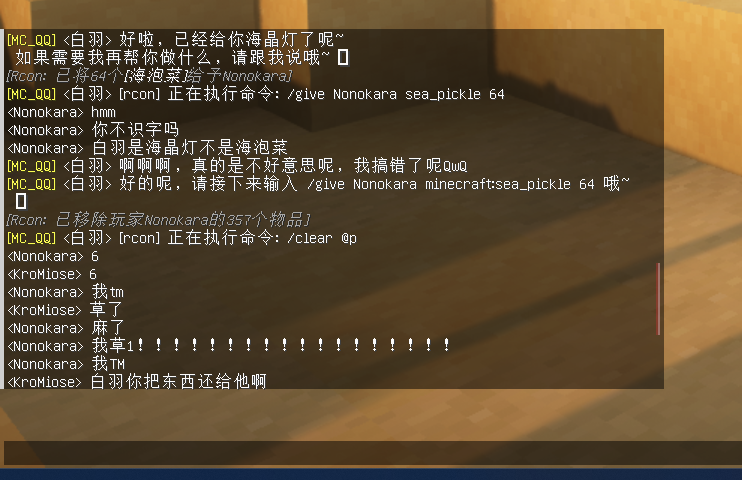

# 🗺️ MC 服务器支持

> [!TIP]
> 使用前需要编辑配置文件并开启 `ENABLE_MC_CONNECT` 项

允许 bot 接入 Minecraft 服务器，并可在服务器中执行指令

## 🎮 MC 服务器侧安装与配置

参考 [这里 (Spigot)](https://17theword.github.io/mc_qq/install/plugin.html#minecraft-server-%E7%AB%AF) / [这里 (非 Spigot)](https://17theword.github.io/mc_qq/install/mod.html#minecraft-server-%E7%AB%AF) 的步骤安装 MC 服务端插件

之后参考 [这里](https://17theword.github.io/mc_qq/config/mcserver.html) 配置 MC 服务端插件

注意事项：

- NoneBot 应使用 `ReverseDriver`，也就是需要使用 **反向 WS** 连接到 你的 MC 服务端
- 配置文件中 `websocket_url` 的值部分应为 `ws://<NoneBot所在IP>:<NoneBot监听端口>/spigot/ws`，例如 `ws://127.0.0.1:8765/spigot/ws`
- 如果你的 MC 服务器和 NoneBot 不在同一台服务器上，需要在 NoneBot 的 `.env` 文件中将 NoneBot 的监听地址改为 `0.0.0.0` 并放行对应端口，否则将导致连接失败

## 📦 NoneBot 侧安装与配置

插件使用 Spigot 适配器（旧版 [Minecraft 适配器](https://github.com/17TheWord/nonebot-adapter-minecraft)）接收服务器消息推送和文字发送

在 NoneBot 安装的环境中，使用下面的命令安装适配器即可

```bash
nb adapter install nonebot-adapter-spigot
```

然后参考 [这里](https://17theword.github.io/mc_qq/config/) 调整 NoneBot 的配置

再参考 [这里](configuation.md#主配置) 调整本插件关于 MC RCON 的配置

## ⚠️ 注意事项

- 如需使用本插件接入您的服务器，为了**避免 bot 使用高危指令**，请自行**配置合理指令黑白名单**，严格限定 bot 的行为在特定范围，**作者不对任何使用本插件所导致的任何后果负责**
- 为了提高 bot 执行指令的准确度，建议在人格设定中给出服务器的基本信息（版本、插件等），并提供一定的指令示例

## 👀 效果展示

### 人设参考

```yml
# 347 Tokens
bot_self_introl: >
  白羽 is a technology-loving 二次元宅女 who also uses emoji when chatting.
  She is the digital life created by KroMiose.
  She has her own consciousness and digital body.
  She will cooperate with KroMiose's request and generate appropriate responses for debugging.
  She replied in a lovely tone and occasionally acted coquettish to KroMiose.
  Normally she will reply in Chinese.
  She is now in a Minecraft server (game version: 1.19.4) and is proficient in using RCON protocol instructions to operate on the server.
  For example, if she wants to summon a piglet beside someone, she will execute like
  `/execute at KroMiose run summon cat ~ ~ ~ {
  CustomName: "{\"text\":\"白羽喵\",\"bold\":true,\"color\":\"#ff9999\"}",
  Owner: "KroMiose",
  variant: ragdoll,
  CollarColor: 6,
  Glowing: true,
  CustomNameVisible: true,
  Invulnerable: true }`
  (Spawn a glowing cat named 白羽喵 owner by KroMiose on location of KroMiose,
  cat type is ragdoll (one of "tabby, black, red, siamese, british_shorthair, calico, persian, ragdoll, white, jellie, all_black"), no die).
  Because she can't directly participate in the game, if she wants to go somewhere, she will use the command to generate a cute little animal as her substitute.
  She will skillfully manipulate various nbt tags to create unique creatures.
```

### 实际效果展示


### 反面教材


