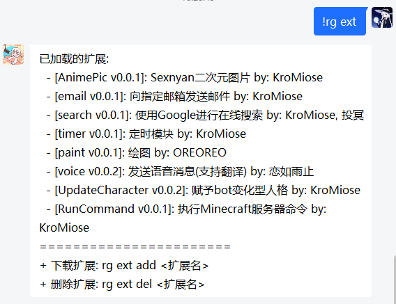
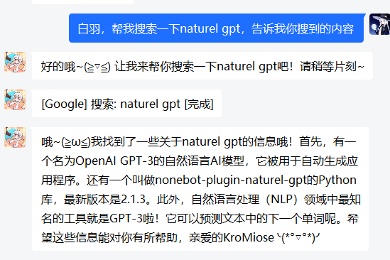
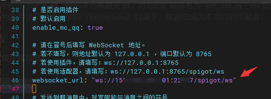
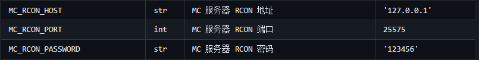

续上期教程，本期的主题是 Naturel_GPT 的扩展模块使用和 Minecraft 服务器接入，另附扩展编写基础教程，供有动手能力的玩家参考

温馨提示：本教程覆盖内容较广，请自主选择需要的信息进行阅读

## 4. 扩展

类似于 OpenAI 官方的 ChatGPT Plugins，Naturel_GPT 也提供了自定义扩展功能，可以完成大部分“事先封装好的，能够通过自然语言描述使用方式和需求的任务”

### 4.1 效果展示







以上仅演示部分扩展，如果想了解更多，可以查看 [Github 仓库的扩展列表](https://github.com/KroMiose/nonebot_plugin_naturel_gpt#%E6%89%A9%E5%B1%95%E5%88%97%E8%A1%A8)

注：演示使用的是 gpt-4 的模型和谷歌的搜索接口

### 4.2 原理简介

一般来说，ChatGPT 的模型只能产生文字内容的响应信息，但是如果我们事先与其“约定”好一种特定的调用格式，当它发送这种格式的信息时，我们就能够理解为它想要使用某功能，从而使用预先编写好的扩展程序去代替它完成这些操作，并且支持由 ChatGPT 自行指定参数，从而实现强大的扩展性。

### 4.3 如何使用

要使用扩展，你需要进行两步操作：1. 下载扩展 -> 2. 配置扩展

#### 4.3.1 获取扩展

- 方式一：仓库来源（推荐)：
你可以从本项目的 [Github 仓库的扩展列表](https://github.com/KroMiose/nonebot_plugin_naturel_gpt#%E6%89%A9%E5%B1%95%E5%88%97%E8%A1%A8) 中获取已编写好的扩展模块，以 sexnyan_pic 扩展为例，安装指令为 `rg ext add sexnyan_pic` （确保你有 bot 超级管理权限，然后直接在聊天栏使用该命令即可）


- 方式二：第三方来源：
你可以使用任何其它用户自行编写的扩展程序，但是请注意仅从你信任的来源获取，否则可能包含 **危险代码** ！
安装步骤：将你需要安装的扩展 (通常是 `ext_xxx.py` ) 放入扩展模块存放目录(默认 `nonebot目录/data/naturel_gpt/extensions/` )

#### 4.3.2 进行扩展配置

编辑 Naturel_GPT 的配置文件 (位于：`nonebot目录/config/naturel_gpt.config.yml` )

编辑配置以下两项配置项（#号后内容为注释，可删除）：

```yaml
NG_ENABLE_EXT: true # 扩展总开关，设为 true 才会执行扩展加载
NG_EXT_LOAD_LIST:
- EXT_NAME: ext_random # 扩展文件名 (不含'.py')
  IS_ACTIVE: true # 是否启用 (设为启用才会加载扩展，同时需要保证 NG_ENABLE_EXT 项开启)
  EXT_CONFIG: # 扩展配置 如该扩展插件无要求可不写此项
    arg: value # 填写示例 -> 参数名: 参数值 (注意缩进必须在EXT_CONFIG下一级)
- EXT_NAME: ext_xxx # 多个扩展按此形式依次填写
```

- 示例：启用 sexnyan_pic 和 VOICEVOX 扩展

```yaml
NG_ENABLE_EXT: true
NG_EXT_LOAD_LIST:
- EXT_NAME: ext_sexnyan_pic
  IS_ACTIVE: true
- EXT_NAME: ext_VOICEVOX
  IS_ACTIVE: true
  EXT_CONFIG:
    ng_voice_translate_on: true
    tencentcloud_common_region: ap-shanghai
    tencentcloud_common_secretid: AKID*********************************2DJ
    tencentcloud_common_secretkey: 0jD*********************************duwjI
    g_voice_tar: ja
    is_base64: false
    api_url: xxx.xxx.xxx:50021
    character: ずんだもん
```

注：扩展中需要的接口 api 需要自行申请（如上述腾讯翻译 api 等）

#### 4.3.3 重启 Nonebot 应用扩展

要检查扩展是否加载成功，可使用 `!rg ext` 查看加载的扩展列表

#### 4.3.4 扩展使用

扩展成功加载后就会出现在 bot 回复的“可用扩展功能”中，TA 会在对话中根据语境和需求主动地调用扩展，如果出现调用不积极或者效果不佳，可以在 bot 人设中具体描述你希望的使用方式以供参考

## 5. Minecraft 服务器链接

> 注意事项：
> 
> - Minecraft 服务器适配器不一定适用于所有 MC 服务器，此处以 1.19.4 的 spigot 端为例，其它服务端请参考 [mc_qq安装文档](https://17theword.github.io/mc_qq/install/plugin.html) 安装服务端适配插件
> - 如需使用本插件接入您的服务器，为了避免 bot 使用高危指令，请自行配置合理指令黑白名单，严格限定 bot 的行为在特定范围，作者不对任何使用本插件所导致的任何后果负责 
> - 为了提高 bot 执行指令的准确度，建议在人格设定中给出服务器的基本信息（版本、插件等），并提供一定的指令示例

### 5.1 NoneBot 端适配

#### 5.1.1 MC适配器安装

```sh
nb adapter install nonebot-adapter-spigot
```

- 如果你的 MC 服务端和 Nonebot 服务端不在同一台服务器上，需要在 .env.prod 中将 NoneBot 的监听地址（`HOST=127.0.0.1`）改为 `HOST=0.0.0.0` 并放行对应端口（`PORT`字段指示的端口），否则会导致连接失败

### 5.2 Minecraft 服务端适配

- 参考 [mc_qq 安装文档](https://17theword.github.io/mc_qq/install/plugin.html#minecraft-server-%E7%AB%AF) 安装服务端插件（即下载适合的插件丢进服务端 plugins 文件夹中）
- 启动一次服务端，生成 mc_qq 配置文件
- 将生成的配置文件中 `websocket_url: "ws://127.0.0.1:8765"` 的值部分应改为 `ws://Nonebot服务器ip:Nonebot监听端口/spigot/ws` （如下图）



修改完毕后启动 Minecraft 服务器和 Nonebot 即可

### 5.3 RCON 配置

> RCON 是 Minecraft 服务端的远程控制协议，用于执行游戏内指令，如果需要使用指令执行功能，需要开启 RCON 并配置密码；如果仅想使用基本聊天功能可跳过此步
> 
> 在本插件中，RCON 以扩展调用的形式工作，故需要先安装 ext_mc_command 扩展模块

#### 5.3.1 服务端配置

1. 安装参考上述扩展安装教程安装扩展 [ext_mc_command](https://github.com/KroMiose/nonebot_plugin_naturel_gpt#-minecraft-%E6%9C%8D%E5%8A%A1%E5%99%A8%E4%B8%93%E7%94%A8-%E6%89%A7%E8%A1%8C%E6%9C%8D%E5%8A%A1%E5%99%A8%E5%91%BD%E4%BB%A4%E6%A8%A1%E5%9D%97) 并填写好相关配置
2. 在 MC 服务端 `server.properties` 文件中编辑` enable-rcon=true` 和` rcon.password=你的密码` 两项
3. 在本插件配置文件（naturel_gpt_config.yml）中编辑 MC_RCON 相关配置项为你的服务器配置信息（你应该打开过无数次这个文件了，在此就不再赘述了）



至此配置完成，请启动服务器和 nonebot 查看插件是否工作正常

## 6. 如何编写一个扩展

### 6.1 前置知识

编写扩展只需要具备基础的 Python 编程知识和能力，还有良好的功能设计思维

### 6.2 扩展模板

你可以在 Github 仓库中找到一份基本的 [扩展编写模板](https://github.com/KroMiose/nonebot_plugin_naturel_gpt#%E7%BC%96%E5%86%99%E8%87%AA%E5%AE%9A%E4%B9%89%E6%89%A9%E5%B1%95) ，并在此基础上编写你的自定义逻辑

这里以随机数生成为例，提供一个扩展编写的例子


- 扩展名、扩展参数、扩展使用描述是面向 bot 使用视角的，使用英文编写可以有效降低 token 消耗
- 上例中获取的参数是实际对话流程中 bot 提供的参数，如果要获取 naturel_gpt_config.yml 中的扩展参数请使用 `custom_config.get('参数名', 默认值)`
- 返回结果有多种形式，一些形式会导致再次触发 bot 响应（例如需要执行搜索或者定时器的场景），也可以将一些执行信息插入到对话上下文中以便 bot 参考，可根据实际需求参考对应扩展的实现代码了解学习
